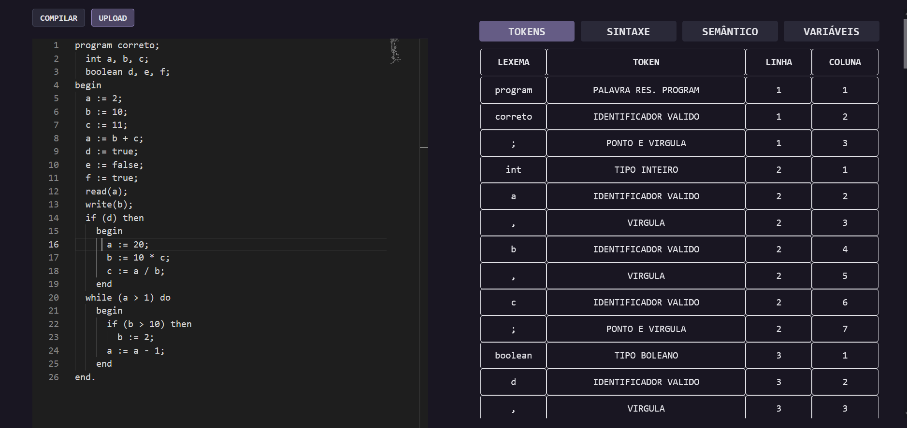
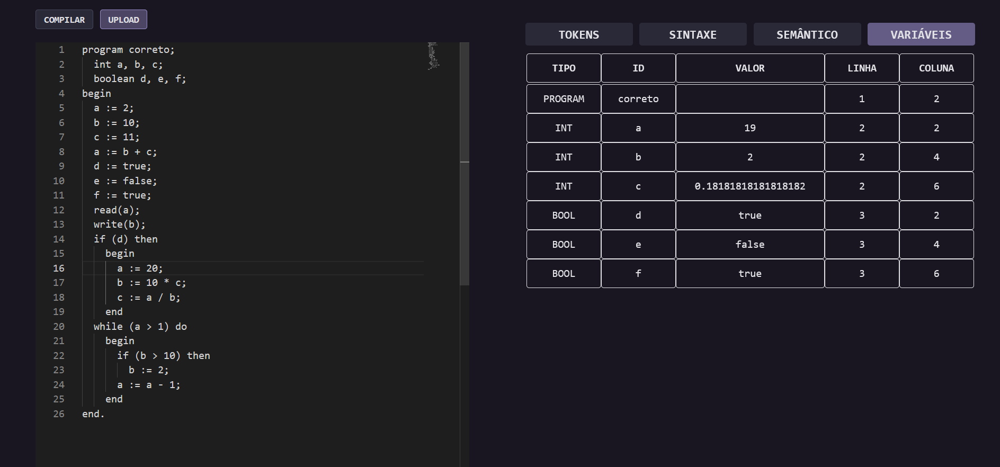

# LALG-Compiler

## Documentação do Compilador LALG

Este é um compilador para a linguagem de programação fictícia chamada LALG. O compilador é capaz de realizar análises léxica, sintática e semântica do código fonte escrito em LALG. Para mais detalhes sobre a sintaxe da linguagem, consulte o arquivo de documentação em EBNF/lalg.pdf.

## Como Acessar

Para utilizar o compilador online, basta acessar o seguinte [link](https://lalg-compiler.vercel.app/)

## Como usar

* Ao abrir o site, você será apresentado a um editor de texto.
* Escreva o código em LALG no editor.
* Clique no botão "Compilar".
* Tabelas indicarão se há erros léxicos, sintáticos ou semânticos.
* Uma tabela exibirá todas as variáveis presentes no código, junto com seus valores.

## Próximos Passos

Atualmente, o compilador realiza análises léxica, sintática e semântica. Os próximos passos incluem implementar a geração de código, permitindo que o compilador traduza o código LALG para código executável.

